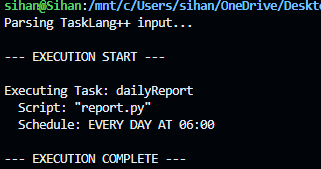
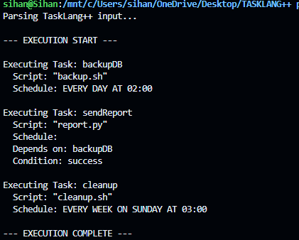
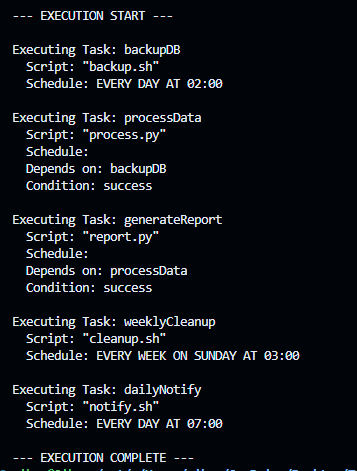

# TaskLang++

**A Domain-Specific Language (DSL) for Task Scheduling and Automation**

---

## Overview

TaskLang++ is a domain-specific language (DSL) and compiler designed to simplify task scheduling and automation. Instead of writing complex cron jobs or verbose scripts, users define tasks in a clean, readable, natural-language-like syntax. The compiler reads `.task` files, validates them through lexical, syntactic, and semantic analysis, and outputs an execution plan.

### Why TaskLang++?

Modern systems rely heavily on task scheduling — from CI/CD pipelines and cron jobs to smart assistants. General-purpose languages can express these, but they are verbose and error-prone. TaskLang++ makes scheduling **declarative, readable, and safe**.

---

## ✨ Key Technical Highlights

This project stands out by moving beyond basic parsing to implement comprehensive compiler logic:

- **LALR(1) Parsing Engine**: Uses Bison to enforce strict, unambiguous grammar validation.
- **Deep Semantic Analysis**: Goes beyond syntax to catch logical flaws before execution.
  - Graph traversal using **Depth-First Search (DFS)** to detect and reject circular dependencies (`taskA -> taskB -> taskA`).
  - Strict reference validation to guarantee `AFTER` clauses point to existing tasks.
  - Duplicate identifier detection to maintain a clean namespace.
- **Topological Sorting Engine**: The executor uses graph algorithms to mathematically sort tasks, ensuring dependencies are perfectly resolved before any execution begins.
- **Robust Error Handling**: Generates precise, line-accurate errors for lexical, syntax, and semantic failures.

---

## DSL Scope

### Supported Task Types
- **Script execution** – Run any shell script or Python file
- **Daily recurring** – Run every day at a specific time
- **Weekly recurring** – Run every week on a specific day and time
- **One-time timed** – Run once at a specific time
- **Dependency-based** – Run after another task completes
- **Conditional** – Run only if a condition (e.g., success) is met

### Scheduling Mechanisms
| Mechanism     | Syntax Example                        | Description                        |
|---------------|---------------------------------------|------------------------------------|
| Daily         | `EVERY DAY AT 06:00`                  | Recurring daily at a fixed time    |
| Weekly        | `EVERY WEEK ON MONDAY AT 08:00`       | Recurring weekly on a specific day |
| Timed         | `AT 15:30`                            | One-time execution at a set time   |
| After (dep.)  | `AFTER backupDB`                      | Runs after another task finishes   |
| Conditional   | `IF success`                          | Runs only if the dependency passed |

### Constraints & Assumptions
- Task names must be unique across the file
- Task names must start with a letter and may contain letters, digits, or underscores
- The `RUN` argument must always be a string literal (in double quotes)
- Time must follow `HH:MM` format (24-hour clock)
- `IF` conditions can only follow an `AFTER` dependency
- Circular dependencies between tasks are **not allowed**

---

## Token Table

| Token Name     | Lexeme         | Description                              |
|----------------|----------------|------------------------------------------|
| `TASK`         | `TASK`         | Begins a task definition block           |
| `RUN`          | `RUN`          | Specifies the command/script to execute  |
| `EVERY`        | `EVERY`        | Recurring schedule keyword               |
| `DAY`          | `DAY`          | Used with EVERY for daily schedules      |
| `WEEK`         | `WEEK`         | Used with EVERY for weekly schedules     |
| `ON`           | `ON`           | Day specifier for weekly schedules       |
| `AT`           | `AT`           | Time specification keyword               |
| `AFTER`        | `AFTER`        | Dependency specification                 |
| `IF`           | `IF`           | Conditional execution keyword            |
| `SUCCESS`      | `success`      | Condition keyword (lowercase)            |
| `WEEKDAY`      | `MONDAY`...    | Day of week (MON–SUN)                    |
| `IDENTIFIER`   | `[a-zA-Z_][a-zA-Z0-9_]*` | Task name or variable        |
| `STRING_LITERAL` | `"..."`      | Quoted string (script/command path)      |
| `TIME`         | `HH:MM`        | 24-hour time literal                     |
| `NUMBER`       | `[0-9]+`       | Integer literal                          |
| `LBRACE`       | `{`            | Opens a task body                        |
| `RBRACE`       | `}`            | Closes a task body                       |
| `SEMICOLON`    | `;`            | Statement terminator                     |

---

## Formal Grammar (EBNF)

```ebnf
program         = { task_definition } ;

task_definition = "TASK" identifier "{" task_body "}" ;

task_body       = run_statement
                  schedule_spec
                  [ condition_spec ] ;

run_statement   = "RUN" string_literal ";" ;

schedule_spec   = daily_schedule
                | weekly_schedule
                | timed_schedule
                | after_schedule ;

daily_schedule  = "EVERY" "DAY" "AT" time ";" ;

weekly_schedule = "EVERY" "WEEK" "ON" weekday "AT" time ";" ;

timed_schedule  = "AT" time ";" ;

after_schedule  = "AFTER" identifier ";" ;

condition_spec  = "IF" condition ";" ;

condition       = "success" ;

time            = digit digit ":" digit digit ;

weekday         = "MONDAY" | "TUESDAY" | "WEDNESDAY" | "THURSDAY"
                | "FRIDAY" | "SATURDAY" | "SUNDAY" ;

identifier      = letter { letter | digit | "_" } ;

string_literal  = '"' { character } '"' ;

digit           = "0" | "1" | "2" | "3" | "4" | "5" | "6" | "7" | "8" | "9" ;

letter          = "a" | ... | "z" | "A" | ... | "Z" ;
```

---

## Compiler Architecture



---

## Example Programs

### 1. Simple Daily Task

```
TASK dailyReport {
    RUN "report.py";
    EVERY DAY AT 06:00;
}
```

**Output:**

<br/>


### 2. Multi-Step Workflow with Dependencies

```
TASK backupDB {
    RUN "backup.sh";
    EVERY DAY AT 02:00;
}

TASK sendReport {
    RUN "report.py";
    AFTER backupDB;
    IF success;
}

TASK cleanup {
    RUN "cleanup.sh";
    EVERY WEEK ON SUNDAY AT 03:00;
}
```

**Output:**

<br/>


### 3. Complex Pipeline Execution

For more advanced scenarios with multiple chained tasks, the topological sorting engine mathematically guarantees the precise order of execution across the dependency graph:



---

## Project Structure

```
TaskLang++/
├── examples/
│   ├── error_examples/
│   │   ├── circular_deps.task     # Circular dependency example
│   │   ├── duplicate_task.task    # Duplicate task definition
│   │   ├── invalid_syntax.task    # Missing semicolons, bad syntax
│   │   ├── type_error.task        # RUN given a number, not string
│   │   └── undefined_task.task    # AFTER references non-existent task
│   ├── complex.task               # Complex multi-task scenario
│   ├── conditions.task            # Conditional execution demo
│   ├── simple_daily.task          # Basic daily schedule
│   └── workflow.task              # Multi-task dependency workflow
├── src/
│   ├── ast.c                      # AST node creation and management
│   ├── ast.h                      # AST struct definitions
│   ├── executor.c                 # Task execution engine
│   ├── executor.h                 # Executor function declarations
│   ├── lexer.l                    # Flex lexer specification
│   ├── main.c                     # Entry point – ties all phases together
│   ├── parser.y                   # Bison parser grammar
│   ├── semantic.c                 # Semantic analysis and validation
│   └── semantic.h                 # Semantic function declarations
├── .gitignore
├── build.sh                       # Linux/WSL build script
├── Makefile                       # Makefile for building the compiler
└── README.md                      # This file
```

---

## Building the Project

### Prerequisites

| Tool           | Purpose                    |
|----------------|----------------------------|
| `gcc`          | C compiler                 |
| `flex`         | Lexer generator (Lex)      |
| `bison`        | Parser generator (Yacc)    |
| `make`         | Build automation           |

### Build (Linux / WSL)

```bash
chmod +x build.sh
./build.sh
```

Or with Make:

```bash
make
```

### Run

```bash
./tasklang examples/simple_daily.task
./tasklang examples/workflow.task
./tasklang examples/error_examples/circular_deps.task
```

---

## Semantic Validations

| Check                     | Description                                                  |
|---------------------------|--------------------------------------------------------------|
| Duplicate task names      | Error if two tasks share the same name                       |
| Undefined task references | Error if `AFTER` references a task that doesn't exist        |
| Type checking             | Error if `RUN` receives a number instead of a string         |
| Circular dependencies     | DFS-based cycle detection in the task dependency graph       |

---

## 🚀 Future Extensions

While fully functional within its defined scope, TaskLang++ lays the groundwork for several advanced features:
- **Symbol Table Implementation**: Upgrading O(N) linear scans to an O(1) Hash Map for scalable compilation of massive task files.
- **Variables & Parameters**: Allowing string interpolation (`RUN "script.sh --user ${user}"`) within tasks.
- **Real Execution Backend**: Hooking the Topological Sorting Engine directly into `cron`, `systemd`, or `schtasks` to actually execute the compiled job plans on the host OS.
- **Language Server Protocol (LSP)**: Providing IDE support (syntax highlighting, inline errors) for `.task` files.

---
## Author

Udayaratna H.S.S
Student ID : IT24103532